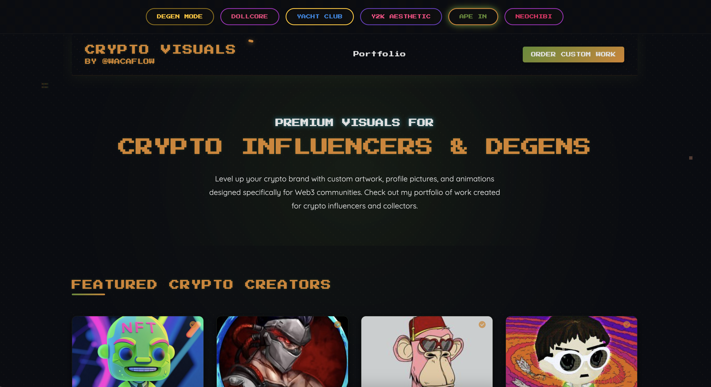

# Custom Artwork Ordering Website

A stylish, responsive website for showcasing and ordering custom digital artwork in multiple theme styles. Designed with a focus on NFT aesthetics and pixel art, this platform connects artists with clients through a simple ordering process.

 

## Features

- **Multiple Theme Options**: Choose between 6 different design themes:
  - Bored Ape (Default)
  - Y2K
  - Degen
  - Dollcore
  - Yacht Club
  - Neochibi

- **Responsive Design**: Fully responsive layout that works on desktops, tablets, and mobile devices

- **Artwork Portfolio**: Dynamic media gallery to showcase artwork examples

- **Influencer Showcase**: Featured section for displaying prominent clients and collaborators

- **Simple Ordering Process**: Clear step-by-step instructions for commissioning custom artwork

- **Modern UI Elements**: Animated components, hover effects, and pixel-perfect styling

## Technologies Used

- HTML5
- CSS3 with custom variables for theming
- Vanilla JavaScript
- Node.js for local development server

## Local Development

To run this website locally:

1. Make sure you have [Node.js](https://nodejs.org/) installed
2. Clone this repository
3. Navigate to the project directory in your terminal
4. Run `node server.js`
5. Open your browser and go to `http://localhost:8080`

## Deployment

This is a static website that can be deployed to any of these free hosting services:

### GitHub Pages (Recommended)
1. Create a GitHub account if you don't have one
2. Create a new repository on GitHub
3. Upload all website files to the repository
   - Click "Add file" → "Upload files"
   - Drag and drop all website files or use the file selector
   - Click "Commit changes"
4. Go to repository "Settings" → "Pages"
5. Under "Source", select "main" branch and click "Save"
6. Your site will be available at `https://[yourusername].github.io/[repository-name]`

### Netlify
1. Create a Netlify account
2. Click "New site from Git" or drag and drop your site folder onto the Netlify dashboard
3. Follow the setup wizard
4. Your site will be live with a Netlify subdomain (e.g., `https://your-site.netlify.app`)

### Vercel
1. Create a Vercel account
2. Click "New Project" and import your repository (or upload files)
3. Follow the setup wizard
4. Your site will be deployed with a Vercel subdomain (e.g., `https://your-site.vercel.app`)

### Cloudflare Pages
1. Create a Cloudflare account
2. Go to the Pages section and connect your GitHub account
3. Select your repository and follow the deployment steps
4. Your site will be available at `https://your-project.pages.dev`

## Customization

### Adding New Artwork

Add new images or videos to the `images/portfolio` directory and update the media gallery section in the HTML.

### Modifying Themes

Color schemes for all themes are defined as CSS variables in the `:root` selector in `css/styles.css`.

### Updating Content

Edit the HTML files to change text content, add new influencers, or modify the order process steps.

## Credits

- Font families: "Press Start 2P" and "Quicksand" (via Google Fonts)
- SVG patterns and icons created in-house
- Design inspired by various NFT and digital art aesthetics

## License

This project is available for personal and commercial use.

---

Created with ❤️ by [Wacaflow] 
